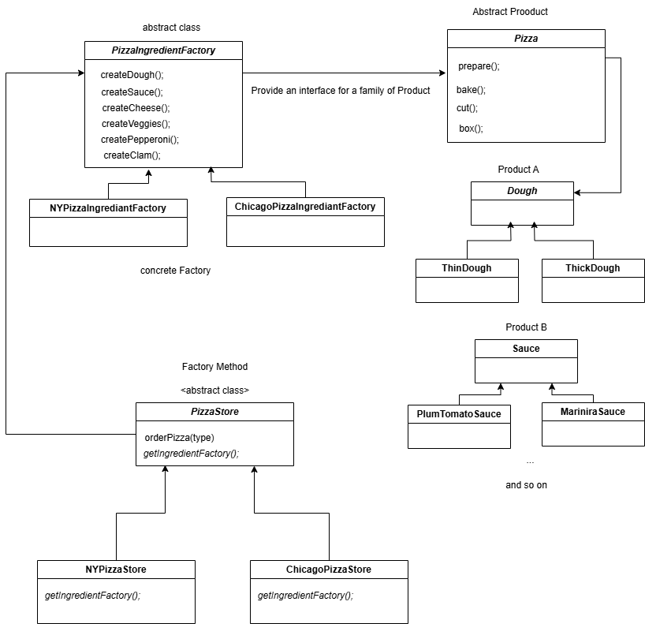

# Abstract Factory
-- -
## official definition:
**_The Abstract Factory Pattern_** provides an interface
for creating families of related or dependent objects
without specifying their concrete classes.
---
