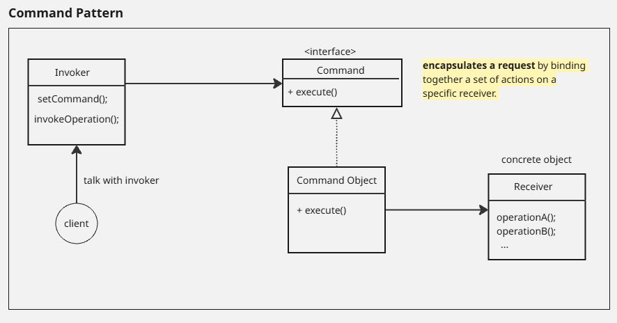

# Command Pattern
--- 
## official definition:
_**The Command Pattern**_ encapsulates a request as an
object, thereby letting you parameterize other objects
with different requests, queue or log requests, and support
undoable operations
---
### Diagram:

