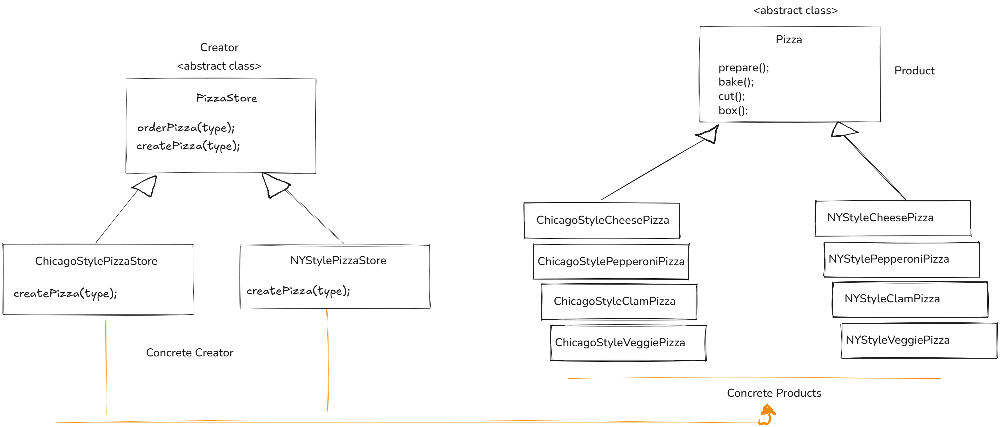

# factory-method pattern
## Official definition:

<i>**The Factory Method Pattern**<i> defines an interface
for creating an object, but lets subclasses decide which
class to instantiate. Factory Method lets a class defer
instantiation to subclasses.
--- 
